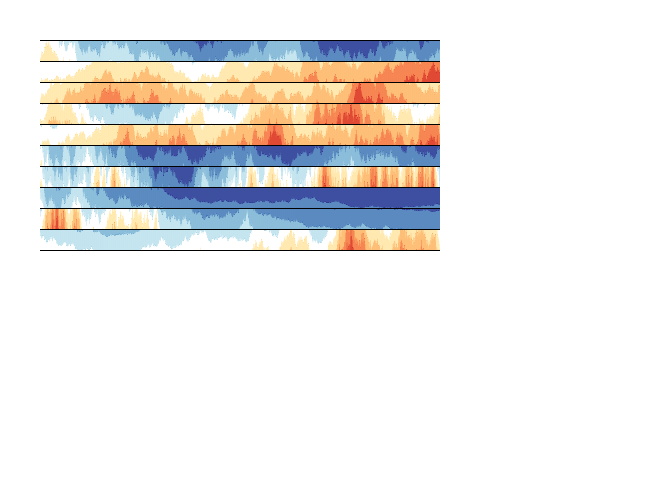

<!-- README.md is generated from README.Rmd. Please edit that file -->
[](https://cran.r-project.org/package=d3horizonR)

### Horizon Charts in R

We can already create [horizon charts](http://www.perceptualedge.com/blog/?p=390) in `graphics`, `lattice`, and `ggplot2`. See [this series of posts](http://timelyportfolio.blogspot.com/search/label/horizonplot) for many examples of static horizon charts in the standard R graphics libraries and an implementation in [`rCharts`](http://timelyportfolio.blogspot.com/2013/07/rcharts-version-of-d3-horizon.html). Also, Karl Broman started an `htmlwidget` [horizon](https://github.com/kbroman/horizon) based on Mike Bostock's [cubism.js](https://square.github.com/cubism), which provides the lovely interactivity missing from the static plots. However, `cubism.js` no longer receives much love and attention (last commit 3 years ago), requires some overhead to setup, and is based on the old version of `d3`.

### d3-horizon-chart

Fortunately, [Kiril Mandov](https://github.com/kmandov) from [Morphocode](https://morphocode.com/) has started to address some of the issues mentioned above with his `d3v4` based [`d3-horizon-chart`](https://github.com/kmandov/d3-horizon-chart). So, even though I am on a self-imposed unpaid open source development ban, I felt compelled to at least start an `htmlwidget` implementation of this plugin. `d3-horizon-chart` does lack some critical features, so I'll also plan to add interactivity, axes, and other functionality.

### Install

This is not on CRAN, so please install with `devtools`. If you have any interest in this `htmlwidget`, please, please let me know.

    devtools::install_github("timelyportfolio/d3horizonR")

### Examples

This is unfinished and very much a work-in-progress, but it does work.

``` r
library(d3horizonR)

d3horizon(
  list(cumprod(1 + runif(1000, -0.05, 0.05))),
  width = 400,
  height = "auto"
)
```


First on my priority list will be easy support of `data.frame` and its derivatives, since I think it is critical, and it is not all that difficult, but for now you will see `list()` enclosing the data argument. For multiple series, do something like this.

``` r
d3horizon(
  data = lapply(1:10, function(x) cumprod(1 + runif(1000, -x/100, x/100)) - 1),
  options = d3horizonOptions(height = 20, mode = "offset"),
  width = 400,
  height = "auto"
)
```



### Development

Unlike many other `htmlwidgets` but similar to `leaflet`, all of the JavaScript code is in `./javascript/d3-horizon-chart`. Please make changes in this directory. Currently, to build new, run `npm run prepublish` which will also copy the necessary `d3horizon.js` into `./inst/htmlwidgets`. The benefit is that `d3` is self-contained so it will not interfere with other `d3v3`-based htmlwidgets.

### Code of Conduct

I am basically begging for some feedback, help, input, issues, anything, but please note that this project is released with a [Contributor Code of Conduct](CONDUCT.md). By participating in this project you agree to abide by its terms.
